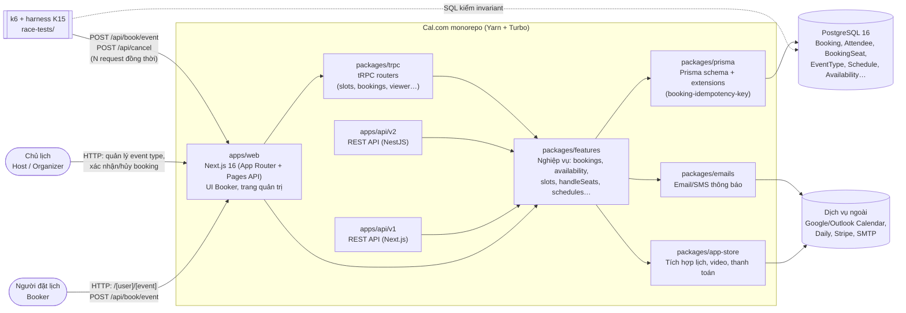
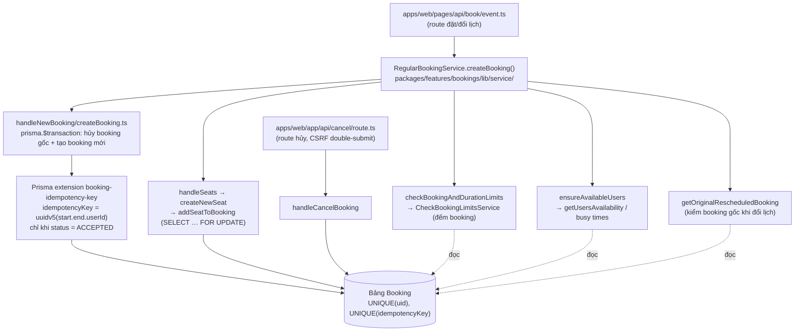
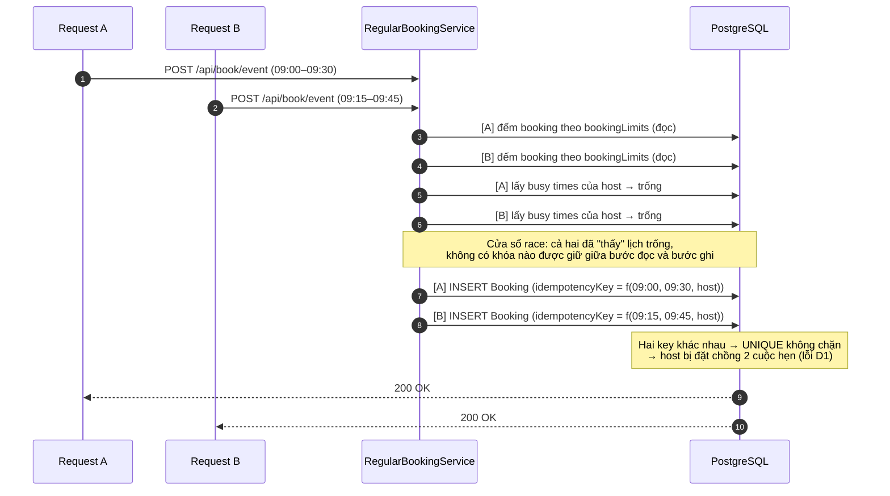

# Sơ đồ kiến trúc và luồng dữ liệu – Cal.com v6.2.0

GitHub và VS Code (có extension Mermaid) hiển thị trực tiếp các sơ đồ dưới đây.

## 1. Sơ đồ container (mức C4-container)

## 2. Các module liên quan trực tiếp tới kiểm thử

## 3. Luồng dữ liệu: đặt lịch và cửa sổ race (TOCTOU)

## 4. Năm nghiệp vụ trọng tâm

| # | Nghiệp vụ | Điểm vào | Dữ liệu ghi |
|---|---|---|---|
| 1 | Đặt lịch event 1-1 | `POST /api/book/event` | `Booking` (ACCEPTED), `Attendee` |
| 2 | Đặt ghế cho event seated | `POST /api/book/event` → `handleSeats` | `Booking` (1 booking/slot), `Attendee`, `BookingSeat` |
| 3 | Đặt lịch cần xác nhận | `POST /api/book/event` (event `requiresConfirmation`) | `Booking` (PENDING) |
| 4 | Đổi lịch | `POST /api/book/event` có `rescheduleUid` | Cập nhật booking gốc → CANCELLED + `rescheduled=true`; tạo booking mới có `fromReschedule` |
| 5 | Hủy lịch | `POST /api/cancel` | `Booking.status` → CANCELLED, `idempotencyKey` → NULL |
